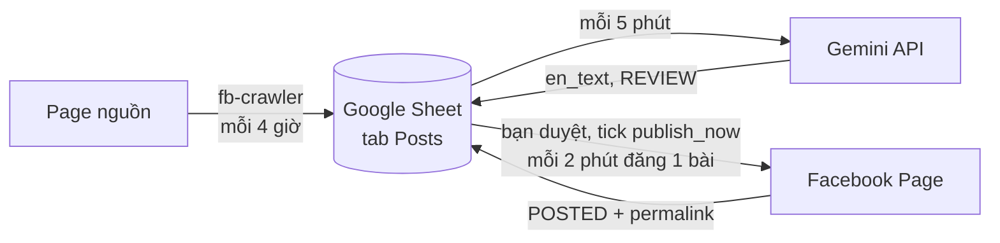

# AutoPost Blog — reup bài Facebook, dịch sang tiếng Anh, đăng lên Page

Máy tự **thu bài** từ các page nguồn (crawler SeleniumBase), tự **dịch** sang tiếng
Anh bằng Gemini API. **Google Sheet** chỉ là nơi lưu bài và duyệt: bạn đọc/sửa bản
dịch, tick một ô là bài lên Page — ảnh lấy từ bài gốc.



Tất cả nằm trong **một workflow n8n** (`n8n/workflows/autopost.json`) với 3 lịch chạy.

| `status` | Nghĩa | Ai làm tiếp |
| --- | --- | --- |
| `NEED_TRANSLATE` | Vừa thu về | n8n tự dịch |
| `REVIEW` | Đã có bản dịch ở `en_text` | **Bạn**: đọc, sửa, tick `publish_now` |
| `POSTING` → `POSTED` | Đang đăng → đã lên Page | — |
| `ERROR` | Lỗi, lý do ở `check_note` | **Bạn**: sửa rồi tick lại |
| `SKIP` | Không đăng | — |

## Cài đặt

1. **[docs/01-facebook-app.md](docs/01-facebook-app.md)** — lấy Page Access Token dài
   hạn để đăng bài (`npm run check:fb` để kiểm tra).
2. **[docs/02-google-sheet.md](docs/02-google-sheet.md)** — tạo Sheet, dán
   `apps-script/Code.gs`, bấm *① Khởi tạo*, điền page nguồn vào tab `Sources`.
3. **[docs/03-n8n-va-crawler.md](docs/03-n8n-va-crawler.md)** — điền `.env`,
   `docker compose up -d --build`, `npm run build`, import **1 file**
   `n8n/local/autopost.json`, chọn 3 credential (Google Sheets, Facebook, Gemini), Active.

Dùng hằng ngày & tra lỗi: **[docs/04-van-hanh-va-loi.md](docs/04-van-hanh-va-loi.md)**.
Chạy 24/7 trên server: **[docs/05-deploy-vps.md](docs/05-deploy-vps.md)**.
Đổi giờ thu bài / dịch / đăng: docs/03 mục 7.

## Thành phần

```
n8n/workflows/autopost.json   Workflow duy nhất (placeholder) — sinh từ tools/build-workflows.mjs
n8n/local/autopost.json       Bản đã điền sẵn từ .env (không commit) — import file này
crawler/                      fb-crawler: Python + SeleniumBase, HTTP API cho n8n
docker-compose.yml            n8n + fb-crawler
apps-script/Code.gs           Tạo cấu trúc Sheet + hộp thoại dịch dự phòng / thêm bài tay
tools/build-workflows.mjs     Nguồn sự thật sinh workflow
tools/validate-workflows.mjs  Kiểm tra cấu trúc workflow
tools/test-logic.mjs          Chạy thật code các node với dữ liệu giả
tools/check-facebook.mjs      Kiểm tra Page Access Token
```

## Lệnh hay dùng

```bash
npm run build                  # sinh workflow (n8n/local/ điền sẵn từ .env)
npm test                       # build + validate + test logic + test crawler
npm run check:fb               # kiểm tra Page Access Token (đọc .env)
docker compose up -d --build   # chạy n8n + fb-crawler
docker compose logs -f fb-crawler
```

## Lưu ý

- **Crawler không cần tài khoản Facebook.** Không đăng nhập thì mỗi lần chỉ thấy ~3
  bài mới nhất/page. Có thể cho crawler dùng cookie để thấy nhiều hơn (docs/03), nhưng
  crawl vi phạm điều khoản Facebook và tài khoản đó có thể bị checkpoint/khoá.
- Link ảnh Facebook **hết hạn sau vài ngày** — duyệt và đăng trong 1–2 ngày.
- Nội dung và ảnh thuộc bản quyền page gốc; page reup dễ bị Facebook giảm phân phối
  hoặc bị báo cáo.
- Sheet id, page id, token chỉ nằm trong `.env` và credential của n8n — không có trong
  file nào được commit.
