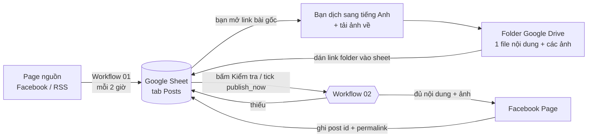

# AutoPost Blog — tự động đăng bài lên Facebook Page

Hệ thống đăng bài bán tự động: **n8n** làm bộ máy, **Google Sheet** làm bảng điều
khiển (trạng thái + nút đăng thủ công), **Google Drive** chứa nội dung đã dịch và
ảnh, **Facebook Graph API** để đăng lên Page.

Bạn giữ toàn quyền quyết định: máy thu link bài nguồn và kiểm tra thành phần, còn
việc dịch nội dung và chọn ảnh là của bạn; bài chỉ lên Page khi bạn bấm đăng
(hoặc hẹn giờ).

---

## 1. Luồng hoạt động



Vòng đời một bài viết, xem ở cột `status`:

| status | Nghĩa | Ai làm bước tiếp theo |
| --- | --- | --- |
| `NEED_CONTENT` | Đã thu được link bài gốc, chưa có nội dung/ảnh | **Bạn**: dịch, up Drive, dán link folder |
| `READY` | Đã kiểm tra: đủ nội dung + ảnh | **Bạn**: tick `publish_now` để đăng |
| `POSTING` | n8n đang gọi Facebook | chờ |
| `POSTED` | Đã lên Page, có `fb_post_id` + `fb_permalink` | xong |
| `ERROR` | Thiếu thành phần / Facebook từ chối — lý do ở `check_note` | **Bạn**: sửa rồi bấm lại |
| `SKIP` | Bạn quyết định không đăng | — |

## 2. Thành phần trong repo

```
n8n/workflows/01-collect-source-posts.json   Thu link bài từ page nguồn → ghi vào sheet
n8n/workflows/02-check-and-publish.json      Kiểm tra đủ thành phần + đăng lên Page
n8n/workflows/03-publish-queue.json          Quét sheet mỗi 5 phút: tick ô / hẹn giờ
apps-script/Code.gs                          Menu + nút bấm + tạo cấu trúc sheet
tools/build-workflows.mjs                    Nguồn sự thật sinh ra 3 file JSON trên
tools/validate-workflows.mjs                 Kiểm tra JSON trước khi import
tools/test-logic.mjs                         Chạy code trong node Code với dữ liệu giả
tools/check-facebook.mjs                     Test Page Access Token trước khi dùng
examples/content.md                          Mẫu file nội dung đặt trong folder Drive
docs/                                        Hướng dẫn cài đặt từng phần
```

> Các file JSON trong `n8n/workflows/` được **sinh ra** từ `tools/build-workflows.mjs`.
> Muốn sửa workflow lâu dài thì sửa file builder rồi chạy `npm run build`, đừng sửa
> JSON bằng tay (sửa trực tiếp trong UI n8n để thử nghiệm thì hoàn toàn được).

## 3. Cài đặt — 5 bước

Chi tiết từng bước ở `docs/`, thứ tự nên làm:

1. **[docs/01-facebook-app.md](docs/01-facebook-app.md)** — tạo app trên
   developers.facebook.com, lấy **Page Access Token dài hạn** với quyền
   `pages_manage_posts` + `pages_read_engagement`.
   Kiểm tra token: `cp .env.example .env` → điền → `npm run check:fb`.
2. **[docs/02-google-drive.md](docs/02-google-drive.md)** — quy ước đặt file trong
   folder bài viết và cách chia sẻ folder cho n8n.
3. **[docs/03-google-sheet-apps-script.md](docs/03-google-sheet-apps-script.md)** —
   tạo Sheet, dán `apps-script/Code.gs`, bấm *Khởi tạo cấu trúc sheet*.
4. **[docs/04-n8n-setup.md](docs/04-n8n-setup.md)** — import 3 workflow, tạo 3
   credential (Google Sheets, Google Drive, Facebook Graph API), điền node
   `Config`, activate.
5. **[docs/05-van-hanh.md](docs/05-van-hanh.md)** — quy trình dùng hàng ngày.

Gặp lỗi: **[docs/06-troubleshooting.md](docs/06-troubleshooting.md)** — tra theo
thông báo trong cột `check_note`.

## 4. Kiểm tra "đủ thành phần" gồm những gì

Workflow 02 chặn việc đăng nếu folder Drive chưa đạt:

- có đúng ≥ 1 file nội dung: `.txt`, `.md` hoặc Google Docs (chính là bài đã dịch
  sang tiếng Anh);
- nội dung không rỗng, ≥ `min_content_chars` ký tự (mặc định 50) và < 60.000 ký tự;
- số ảnh nằm trong khoảng `min_images`…`max_images` (mặc định 1…10 — Facebook chỉ
  cho tối đa 10 ảnh trong một bài);
- ảnh đúng định dạng `jpg/png/gif/webp` và không vượt `max_image_mb` (mặc định 8MB);
- ảnh được upload hết lên Facebook trước khi tạo bài — nếu chỉ upload được một
  phần, bài **không** được tạo (tránh đăng thiếu ảnh);
- bài đã `POSTED` sẽ không đăng lại (trừ khi gửi `force: true`).

Mọi lỗi được ghi thẳng vào cột `check_note` của dòng đó, kèm `status = ERROR`.

## 5. Ba cách để "bấm đăng"

| Cách | Cần gì | Độ trễ |
| --- | --- | --- |
| Menu **🚀 Auto Post → 📤 Đăng bài đang chọn** | Apps Script đã cấu hình | ngay |
| **Tick ô `publish_now`** | thêm trigger onEdit (menu ③) | ngay |
| **Tick ô `publish_now`** hoặc điền `scheduled_at` | chỉ cần workflow 03 bật | ≤ 5 phút |

Cách 3 là lưới an toàn: kể cả khi Apps Script chưa cài, chỉ cần tick ô là workflow
03 sẽ thấy và đăng trong vòng 5 phút.

## 6. Bảo mật

- Webhook n8n được bảo vệ bằng `webhook_secret` (so khớp trong node `Config`);
  gọi sai secret trả về 401. Đổi secret ở cả 3 nơi: node Config của workflow 02,
  node Config của workflow 03, và menu ② trong Sheet.
- Token Facebook chỉ nằm trong credential của n8n; không có token nào trong repo
  hay trong Sheet.
- `.env` (dùng cho script kiểm tra) đã được `.gitignore`.

## 7. Lệnh hay dùng

```bash
npm run build       # sinh lại n8n/workflows/*.json từ builder
npm run validate    # kiểm tra cấu trúc workflow, biểu thức, cú pháp node Code
npm run test:logic  # chạy thật code kiểm tra thành phần với dữ liệu giả (36 test)
npm test            # build + validate + test logic
npm run check:fb    # kiểm tra Page Access Token (đọc .env)
npm run check:fb -- --post   # đăng thử 1 bài chế độ chỉ-mình-tôi-thấy
```
